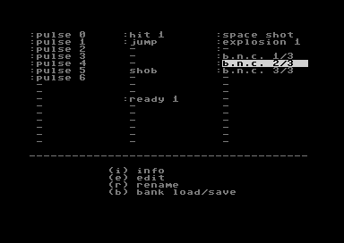
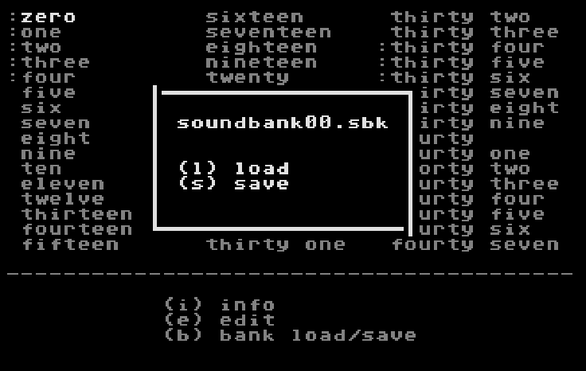
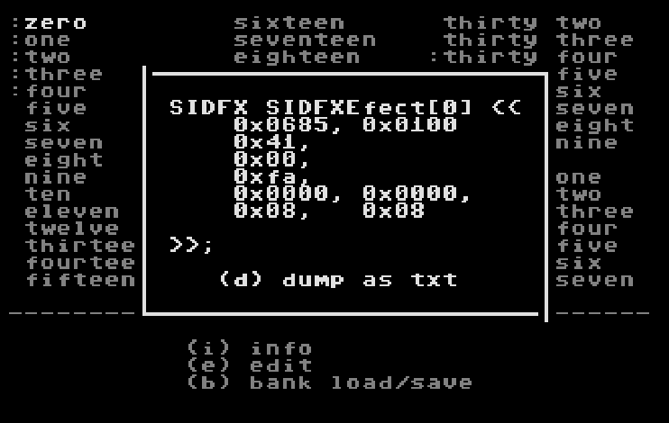
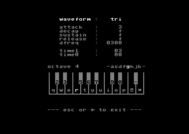

# Only disc drive 8 is supported.

### Sound Bank window



Main screen.
```
cursor keys   - move and play sound
h j k l       - move and play sound
space, enter  - play sound
i             - show info about current sound
e             - edit sound
r             - rename sound
b             - go to load/save sound bank menu
```


### Sound Bank load/save menu window



```
l               - load file 'soundbank00.sbk' from disc drive 8
s               - save file 'soundbank00.sbk' to disc drive 8
←, escape, b    - close window ( KEY_ARROW_LEFT, KEY_ESCAPE and KEY_B )
```

### Sound info window



Show info about current sound in 'oscar64' SIDFX structure format.
```
d     - dump as txt file to disc drive 8
←, escape, i    - close window ( KEY_ARROW_LEFT, KEY_ESCAPE and KEY_I )
```

### Edit menu window



```
cursor keys - up/down     - move
            - left/right  - change value
enter       - change digit to edit
asdfghjk    - change octave accordingly
q2w3er5t... - piano ( set frequency for sound )
←, escape   - close window ( KEY_ARROW_LEFT and KEY_ESCAPE )
```

### Label edit widget


```
In name you can use:

0-9                 - digits
a-z                 - letters
space               - as space
!#$%&(),.:?/-       - characters
restore             - works as backspace
←, escape           - close window ( KEY_ARROW_LEFT and KEY_ESCAPE )
up, down, return    - exit edition
```
