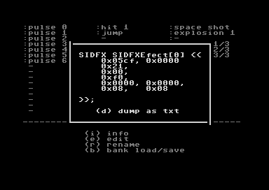

# So far, only disc drive 8 is supported.

# Sound Bank view


This is the main screen.

```
cursor keys   - move and play sound

space, enter  - play sound

b             - go to load/save sound bank menu

i             - show info about current sound

e             - edit sound

On any screen pressing < SPACE > will take you back here, to the main screen.
```


# Sound Bank load/save menu view


```
l     - load sound bank file 'soundbank00.sbk' from disc drive 8
s     - save sound bank file 'soundbank00.sbk' to disc drive 8
space - close window
```

# Sound info view



Show info about current sound in 'oscar64' SIDFX structure format.
```
d     - dump as txt file to disc drive 8
space - close window
```

# Edit menu view


```
cursor keys - up/down     - move
            - left/right  - change value
enter       - change digit to edit
asdfghjk    - change octave accordingly
q2w3er5t... - piano ( set frequency for sound )
```

