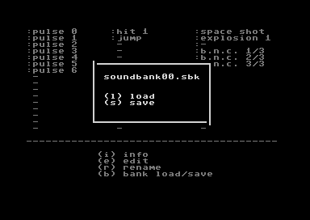

# Only disc drive 8 is supported.

### Sound Bank window


Main screen.
```
cursor keys   - move and play sound
space, enter  - play sound
i             - show info about current sound
e             - edit sound
b             - go to load/save sound bank menu
```


### Sound Bank load/save menu window



```
l     - load file 'soundbank00.sbk' from disc drive 8
s     - save file 'soundbank00.sbk' to disc drive 8
space - close window
```

### Sound info window


Show info about current sound in 'oscar64' SIDFX structure format.
```
d     - dump as txt file to disc drive 8
space - close window
```

### Edit menu window


```
cursor keys - up/down     - move
            - left/right  - change value
enter       - change digit to edit
asdfghjk    - change octave accordingly
q2w3er5t... - piano ( set frequency for sound )
space       - close window
```

